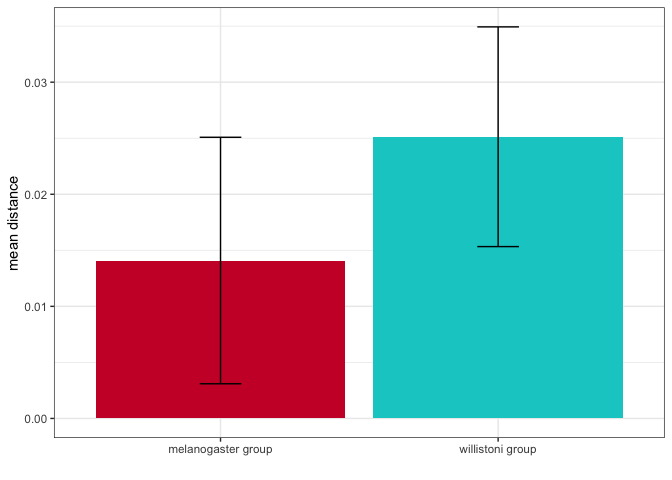

Branch len test
================

``` r
suppressPackageStartupMessages(library(tidyverse))
suppressPackageStartupMessages(library(knitr))
suppressPackageStartupMessages(library(kableExtra))
suppressPackageStartupMessages(library(svglite))
suppressPackageStartupMessages(library(ape))
theme_set(theme_bw())

knitr::opts_knit$set(root.dir = "/Volumes/Storage")
```

``` r
tree <- read.nexus("/Volumes/Storage/Dmel-spoink/REVISION/species-tree/dmel-dwil-dsim-selected/tree/insertions-insertions.tree")

PatristicDistMatrix <- cophenetic(tree)

dist <- as.data.frame(as.table(PatristicDistMatrix)) %>% as.tibble()
```

    ## Warning: `as.tibble()` was deprecated in tibble 2.0.0.
    ## ℹ Please use `as_tibble()` instead.
    ## ℹ The signature and semantics have changed, see `?as_tibble`.
    ## This warning is displayed once every 8 hours.
    ## Call `lifecycle::last_lifecycle_warnings()` to see where this warning was
    ## generated.

``` r
colnames(dist) <- c("B","A","dist")

dist
```

    ## # A tibble: 5,184 × 3
    ##    B       A          dist
    ##    <fct>   <fct>     <dbl>
    ##  1 D.car-2 D.car-2 0      
    ##  2 D.car-3 D.car-2 0.00415
    ##  3 D.car-4 D.car-2 0.00497
    ##  4 D.car-5 D.car-2 0.00345
    ##  5 D.car-6 D.car-2 0.00826
    ##  6 D.car-7 D.car-2 0.00533
    ##  7 D.equ-1 D.car-2 0.0468 
    ##  8 D.equ-2 D.car-2 0.0468 
    ##  9 D.equ-3 D.car-2 0.0468 
    ## 10 D.equ-4 D.car-2 0.0468 
    ## # ℹ 5,174 more rows

``` r
wil <- c("D.equ-1","D.equ-2","D.equ-3","D.equ-4","D.ins-1","D.ins-2","D.ins-3","D.ins-4","D.tro-1","D.tro-2","D.tro-3","D.tro-4","D.tro-5","Dpau06-1","Dpau06-2","Dpau06-3","Dpau06-4","Dpau06-5","Dpau06-6","Dpau06-7","Dpau06-8","Dpau06-9","Dwil17-2","Dwil17-3","Dwil17-4")

mel <- c("D.sec-1","D.sec-2","D.sec-3","D.sec-4","D.sec-5","D.sec-6","DmelR7-1","DmelR7-10","DmelR7-11","DmelR7-12","DmelR7-13","DmelR7-14","DmelR7-15","DmelR7-16","DmelR7-17","DmelR7-18","DmelR7-19","DmelR7-2","DmelR7-20","DmelR7-21","DmelR7-3","DmelR7-4","DmelR7-5","DmelR7-6","DmelR7-7","DmelR7-8","DmelR7-9","DsimS9-1","DsimS9-10","DsimS9-11","DsimS9-12","DsimS9-13","DsimS9-14","DsimS9-2","DsimS9-3","DsimS9-4","DsimS9-5","DsimS9-6","DsimS9-7","DsimS9-8","DsimS9-9")

(wil_tab <- dist %>% filter(A %in% wil) %>% select(A, B, dist))
```

    ## # A tibble: 1,800 × 3
    ##    A       B          dist
    ##    <fct>   <fct>     <dbl>
    ##  1 D.equ-1 D.car-2 0.0468 
    ##  2 D.equ-1 D.car-3 0.0468 
    ##  3 D.equ-1 D.car-4 0.0468 
    ##  4 D.equ-1 D.car-5 0.0468 
    ##  5 D.equ-1 D.car-6 0.0468 
    ##  6 D.equ-1 D.car-7 0.0468 
    ##  7 D.equ-1 D.equ-1 0      
    ##  8 D.equ-1 D.equ-2 0.00147
    ##  9 D.equ-1 D.equ-3 0.0282 
    ## 10 D.equ-1 D.equ-4 0.00195
    ## # ℹ 1,790 more rows

``` r
(mel_tab <- dist %>% filter(A %in% mel) %>% select(A, B, dist))
```

    ## # A tibble: 2,952 × 3
    ##    A       B         dist
    ##    <fct>   <fct>    <dbl>
    ##  1 D.sec-1 D.car-2 0.0468
    ##  2 D.sec-1 D.car-3 0.0468
    ##  3 D.sec-1 D.car-4 0.0468
    ##  4 D.sec-1 D.car-5 0.0468
    ##  5 D.sec-1 D.car-6 0.0468
    ##  6 D.sec-1 D.car-7 0.0468
    ##  7 D.sec-1 D.equ-1 0.0225
    ##  8 D.sec-1 D.equ-2 0.0225
    ##  9 D.sec-1 D.equ-3 0.0282
    ## 10 D.sec-1 D.equ-4 0.0225
    ## # ℹ 2,942 more rows

``` r
write_tsv(wil_tab, "/Volumes/Storage/Dmel-spoink/REVISION/branch-len/genetic_distance_wil.tsv")
write_tsv(mel_tab, "/Volumes/Storage/Dmel-spoink/REVISION/branch-len/genetic_distance_mel.tsv")
```

``` r
df_mel <- mel_tab %>%
  filter(A != B) %>%
  filter(!grepl("D.car", B))

df_wil <- wil_tab %>%
  filter(A != B) %>%
  filter(!grepl("D.car", B))


sampled_values_clade1 <- sample(df_mel$dist, 100, replace = TRUE)
sampled_values_clade2 <- sample(df_wil$dist, 100, replace = TRUE)

t_test_result <- t.test(sampled_values_clade1, sampled_values_clade2)

print(t_test_result)
```

    ## 
    ##  Welch Two Sample t-test
    ## 
    ## data:  sampled_values_clade1 and sampled_values_clade2
    ## t = -7.4974, df = 195.44, p-value = 2.218e-12
    ## alternative hypothesis: true difference in means is not equal to 0
    ## 95 percent confidence interval:
    ##  -0.01394857 -0.00813857
    ## sample estimates:
    ##  mean of x  mean of y 
    ## 0.01408930 0.02513287

``` r
mean_value_clade1 <- mean(sampled_values_clade1)
mean_value_clade2 <- mean(sampled_values_clade2)
sd_value_clade1 <- sd(sampled_values_clade1)
sd_value_clade2 <- sd(sampled_values_clade2)

df_summary <- data.frame(
  clade = c("Clade 1", "Clade 2"),
  mean_dist = c(mean_value_clade1, mean_value_clade2),
  sd_value = c(sd_value_clade1, sd_value_clade2)
)

g_clades <- ggplot(df_summary, aes(x = clade, y = mean_dist, fill = clade)) +
  geom_bar(stat = "identity", alpha = 1, position = "dodge") +
  geom_errorbar(aes(ymin = mean_dist - sd_value, ymax = mean_dist + sd_value), 
                position = position_dodge(width = 0.9), width = 0.15) +
  labs(x = "",
       y = "mean distance") +
  scale_fill_manual(values = c("#CC0033","#00cccc")) +
  scale_x_discrete(labels = c("melanogaster group", "willistoni group"))+
  theme(legend.position = "none")  # Rotate x-axis text

plot(g_clades)
```

<!-- -->

``` r
ggsave("/Volumes/Storage/Dmel-spoink/REVISION/branch-len/branch-length-test.png", g_clades)
```

    ## Saving 7 x 5 in image
